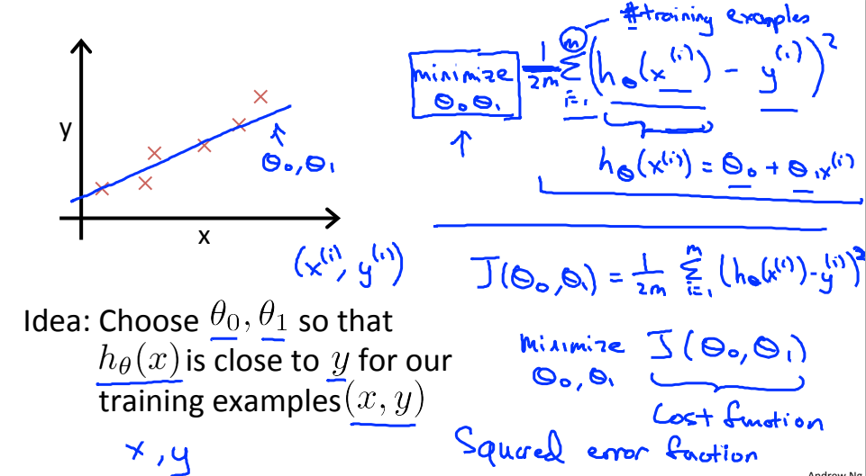

# ML:Linear Regression with One Variable

### Model Representation

Recall that in _regression problems_, we are taking input variables and trying to fit the output onto a _continuous_ expected result function.

Linear regression with one variable is also known as "univariate linear regression."

Univariate linear regression is used when you want to predict a **single output** value y from a **single input** value x. We're doing **supervised learning** here, so that means we already have an idea about what the input/output cause and effect should be.

### The Hypothesis Function

Our hypothesis function has the general form:

$$\hat{y} = h_\theta(x) = \theta_0 + \theta_1 x$$&#x20;

Note that this is like the equation of a straight line. We give to $$h_\theta(x)$$ values for $$\theta_0$$ ​and $$\theta_1​$$ to get our estimated output $$\hat{y}$$ . In other words, we are trying to create a function called $$h_\theta$$ that is trying to map our input data (the x's) to our output data (the y's).

#### Example:

Suppose we have the following set of training data:

| input x | output y |
| ------- | -------- |
| 0       | 4        |
| 1       | 7        |
| 2       | 7        |
| 3       | 8        |

Now we can make a random guess about our $$h_\theta​$$ function: $$\theta_0=2$$ and $$\theta_1=2$$ . The hypothesis function becomes $$h_\theta(x)=2+2x$$.

So for input of 1 to our hypothesis, y will be 4. This is off by 3. Note that we will be trying out various values of $$\theta_0$$​ and $$\theta_1$$​ to try to find values which provide the best possible "fit" or the most representative "straight line" through the data points mapped on the x-y plane.

## Cost Function

We can measure the accuracy of our hypothesis function by using a **cost function**. This takes an average (actually a fancier version of an average) of all the results of the hypothesis with inputs from x's compared to the actual output y's.

$$
J(\theta_0, \theta_1) = \dfrac {1}{2m} \displaystyle \sum _{i=1}^m \left ( \hat{y}_{i}- y_{i} \right)^2  = \dfrac {1}{2m} \displaystyle \sum _{i=1}^m \left (h_\theta (x_{i}) - y_{i} \right)^2
$$

To break it apart, it is $$\frac{1}{2}​ \bar{x}$$ where $$\bar{x}$$ is the mean of the squares of $$h_\theta (x_{i}) - y_{i}$$​ , or the difference between the predicted value and the actual value.

This function is otherwise called the "Squared error function", or "Mean squared error". The mean is halved $$\left(\frac{1}{2m}\right)$$ as a convenience for the computation of the gradient descent, as the derivative term of the square function will cancel out the $$\frac{1}{2}$$term.

Now we are able to concretely measure the accuracy of our predictor function against the correct results we have so that we can predict new results we don't have.

## Cost Function - Intuition I

If we try to think of it in visual terms, our training data set is scattered on the x-y plane. We are trying to make straight line (defined by $$h_\theta(x)$$) which passes through this scattered set of data.

Our objective is to get the best possible line. The best possible line will be such so that the average squared vertical distances of the scattered points from the line will be the least. In the best case, the line should pass through all the points of our training data set. In such a case the value of $$J(\theta_0, \theta_1)$$ will be 0.

The following example shows the ideal situation where we have a cost function of 0.

When $$\theta_1$$ = 1, we get a slope of 1 which goes through every single data point in our model. Conversely, when $$\theta_1 = 0.5$$, we see the vertical distance from our fit to the data points increase.

This increases our cost function to 0.58. Plotting several other points yields to the following graph:

## Cost Function - Intuition II

A contour plot is a graph that contains many contour lines. A contour line of a two variable function has a constant value at all points of the same line. An example of such a graph is the one to the right below.

.png>)

Taking any color and going along the 'circle', one would expect to get the same value of the cost function. For example, the three green points found on the green line above have the same value for $$J(\theta_0,\theta_1)$$and as a result, they are found along the same line. The circled x displays the value of the cost function for the graph on the left when $$\theta_0​ = 800$$ and $$\theta_1​= -0.15$$. Taking another h(x) and plotting its contour plot, one gets the following graphs:

.png>)

When $$\theta_0​ = 360$$ and $$\theta_1​ = 0$$, the value of $$J(\theta_0,\theta_1)$$in the contour plot gets closer to the center thus reducing the cost function error. Now giving our hypothesis function a slightly positive slope results in a better fit of the data.

.png>)

The graph above minimizes the cost function as much as possible and consequently, the result of $$\theta_1$$​ and $$\theta_0$$ tend to be around 0.12 and 250 respectively. Plotting those values on our graph to the right seems to put our point in the center of the inner most 'circle'.
